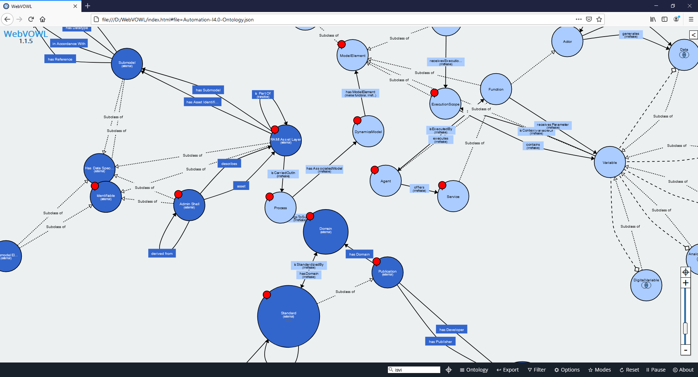

# Automation I4.0 Ontology Project

### Update 03/2021
- Incorporation of the RAMI Ontology (https://github.com/i40-Tools/RAMIOntology).
- Change of classes and relations. Extended concepts.
- There are 2 case studies: A basic metal separation process (folder `Automation-I40-Ontology-CaseStudy`) and a scenario of the x-PPU of AIS TUM (folder `xPPU-AI40-CaseStudy` - please see https://github.com/x-PPU and https://mediatum.ub.tum.de/doc/1208973).
- The Java applications for both case studies now use Maven for the management of dependencies.
- All the owl files now use the RDF/XML serialization.
- Json ontology files are now available in the folder `webvowl` to be visualized on a web browser with the WebVOWL tool (http://vowl.visualdataweb.org/webvowl.html).
- The folder `Generated Java Code` has the java generated code provided by Protégé of both the Automation I4.0 Ontologies, the full and short versions.

### Update 20/05/2019
The description and code of the SWRL rules and OWL Expressions are available in the document `SWRL Rules and OWL Expressions - Automation I4.0 Ontology.docx` discriminated by ontology.

### Update 13/03/2019
The Automation-I4.0-Ontology has been updated. Some fixes and new features have been added.  
- The Automation-I4.0-Ontology (merged with the STO) is complete, but not tested yet.
- The Automation-I4.0-Ontology (without the STO) is complete, running, and tested in Protégé and the application.
- The example application is already available in the folder `AutomationI40Ontology-Example`.
- Some fixes and changes in the Discrete Dynamics Ontology (`ddo.owl`), Core Ontology (Automation-I4.0-Core-Ontology), and Minified Standards Ontology (`min-std-o.owl`) were done.
- New files added: `Automation-I4.0-Min-Ontology - Application.owl` to run with the Application example (owl file with no instances). `Automation-I4.0-Min-Ontology - CodeGeneration.owl` to export the Java code in Protégé (this file has different domains in some properties to accept multiple classes in Java domain properties).
- RDF-OWL-(TTL - Original STO) Serializations for consolidated ontologies.

### Initial commit 04/01/2019
The Automation-I4.0-Ontology is intended to cover a new perspective of the automation systems by means of the use of the Semantic Web Technologies(SWT).

The main ontology `Automation-I4.0-Ontology.owl or .rdf` is composed by several modules which contain specific semantic models.
- The Automation-I4.0-Core-Ontology `automation-I4.0-core-ontology-v1.3.owl` which contains the core, the body of the complete ontology.
- The Discrete-Dynamics-Ontology (DDO) `ddo-v2.owl` which contains the semantic representation of discrete dynamics models (Automatas, Petri Nets).
- The Minified-Standards-Ontology `min-std-o.owl` which is a little ontology to integrate the partial main ontology (`Automation-I4.0-Min-Ontology.owl`) with the Standards Ontology (`sto-owl.owl`).
- The Standards Ontology `sto-owl.owl` by Grangel et al (https://github.com/i40-Tools/StandardOntology) serialized in owl format.

The integrated Automation-I4.0-Ontology with the STO is not yet stable to use with any reasoner. I recommend to use the Automation-I4.0-Min-Ontology by now; it is the same ontology without the Standards Ontology.  

RDF serializations are available for `Automation-I4.0-Ontology` and `Automation-I4.0-Min-Ontology`.  

## Features

### Core Ontology
The core ontology is composed by several classes and axioms.  
It contains many well-defined SWRL rules.   

### DDO
It is the more difficult and low-level ontology. Contains several aspects of discrete dynamics desing for Automatas and Petri Nets.  
Unlike to common Automata-PN models, it provides high-level and advanced concepts which enable "cognitive" aspects for automation systems in the Industry 4.0.  
As it has many features, some more useful than others, it may lack of other ones (It is a complex task to define such concepts). Feel free to contribute with them.  
The DDO is composed by several classes and axioms.  
It contains many well-defined SWRL rules.  

### Minified Standards Ontology
It is a simple ontology that makes easier the integration of the STO and the Automation-I4.0-Min-Ontology.  
It has few classes.  
It has some well-defined SWRL rules.  

### STO
The Standards Ontology is a work done by Irlán Grangel, Steffen Lohman, and Paul Baptista at Fraunhofer IAIS. Please see https://github.com/i40-Tools/StandardOntology , https://vocol.iais.fraunhofer.de/sto/ for more details.  

### RAMI Ontology
The RAMI Ontology which bases on the RAMI Model and the Administration Shell concept. Please see https://github.com/i40-Tools/RAMIOntology, https://vocol.iais.fraunhofer.de/rami/ for more details.

## Research
This project was carried out currently under my master's thesis "A proposal of a formal model to integrate distributed service-based automation systems, semantic models, and automation standards." at the Universidad Nacional de Colombia, in Medellín, Colombia.  
I keep on doing enhancements and adding new features.  
If you use any resources of this project for your research please cite:  
- "Semantic Automation Systems, a Suitable Approach for Automation Networks in the Industry 4.0", https://ieeexplore.ieee.org/document/8921156.

## Cases
Check the folders `Automation-I40-Ontology-CaseStudy` and `xPPU-AI40-CaseStudy` to see 2 Java maven applications using the Automation I4.0 Ontology.  

## Contribution and support
If you are interested in contribute to this project, feel free to do it.  
Regarding to the support, I am working on it continuously, so, if any problem appears, do not hesitate to create an issue.  

## License
Automation-I4.0-Ontology is licensed by an Apache License 2.0 (see http://www.apache.org/licenses/LICENSE-2.0 for more details).  
Copyright 2019 Santiago Gil
